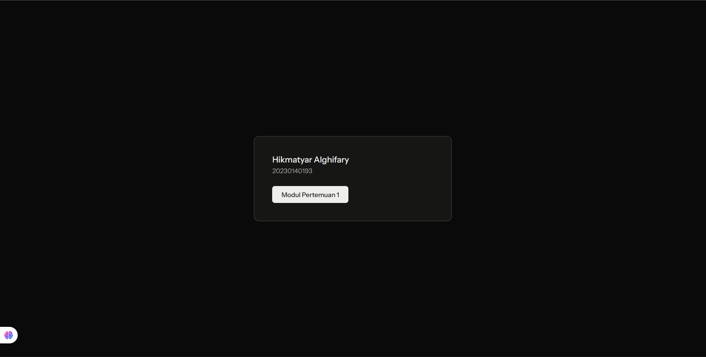

# Dokumentasi Tugas 1 - Praktikum Pengembangan Web Framework

Pengerjaan Tugas 1 meliputi implementasi fitur List Data, Entry Data, dan integrasi dengan Firebase sebagai database.

## Ringkasan Tampilan Halaman

Berikut adalah daftar tangkapan layar (screenshot) dari fungsionalitas aplikasi yang telah dikembangkan:

| No | Nama Halaman | Keterangan | Screenshot |
|:--:|:--------------|:-----------|:-----------|
| 1 | **Home List Data (Kosong)** | Tampilan awal saat database belum memiliki data. |  |
| 2 | **Form Entry Data** | Halaman untuk menginputkan data baru ke sistem. |  |
| 3 | **Proses Isi Data** | Visualisasi saat pengguna sedang melakukan pengisian form. |  |
| 4 | **Home List Data (Berisi)** | Tampilan halaman utama setelah data berhasil tersimpan. |  |
| 5 | **Database Firebase** | Pembuktian data telah tersimpan secara real-time di Cloud Firebase. |  |

---
*Dokumentasi ini disusun sebagai bagian dari pemenuhan tugas mata kuliah Praktikum Pengembangan Web Framework.*
