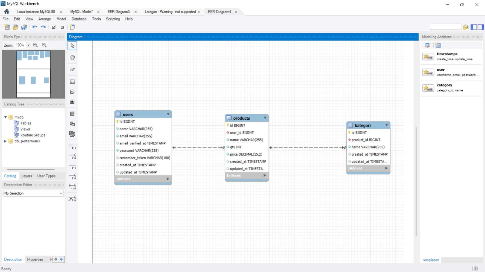
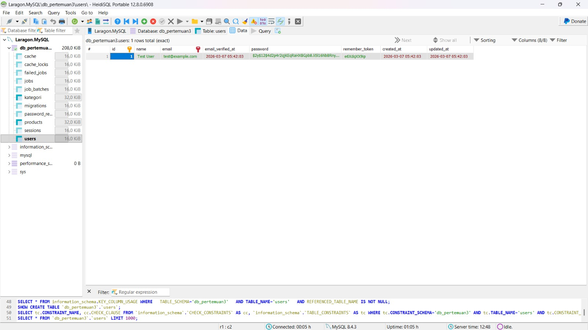
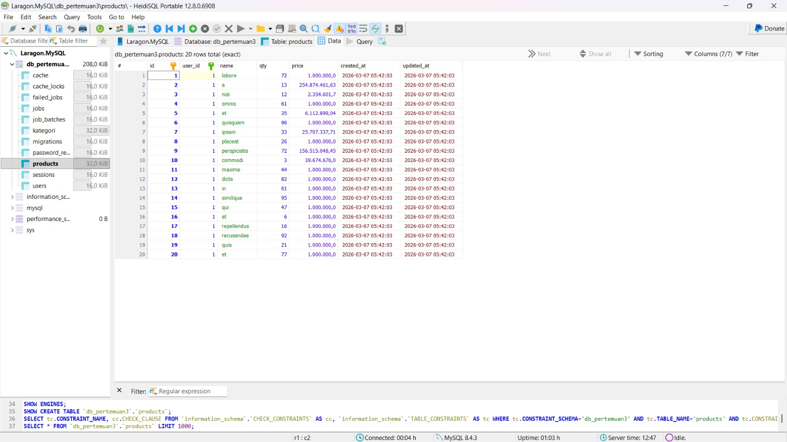
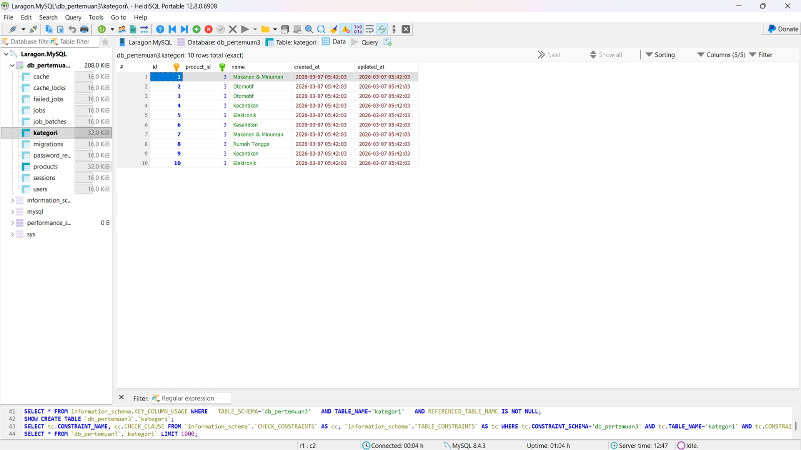

# Laporan Tugas Praktikum - Modul 3: ERD, Model, dan Migration

**Nama:** Hikmatyar Alghifary  
**NIM:** 20230140193  
**Mata Kuliah:** Praktikum Pemrograman Web Framework

---

## 1. Analisis Entity Relationship Diagram (ERD)

Berikut adalah rancangan ERD yang diimplementasikan pada pertemuan ini:

Sistem ini terdiri dari tiga entitas utama:
- **Users**: Pengguna sistem.
- **Products**: Produk yang dimiliki oleh user.
- **Kategori**: Kategori yang terkait dengan produk.

---

## 2. Implementasi Migration dan Database

Saya telah mengonfigurasi file `.env` untuk terhubung ke database `db_pertemuan3` melalui Laragon (Port 3306). Tabel-tabel berhasil dibuat menggunakan perintah `php artisan migrate`.

### Struktur Tabel Users
Tabel bawaan Laravel yang disesuaikan untuk menyimpan data pengguna.

### Struktur Tabel Products
Menyimpan data produk dengan relasi ke tabel `users`.

### Struktur Tabel Kategori
Menyimpan kategori dengan relasi ke tabel `products`.

---

## 3. Implementasi Model dan Seeder

### Model Relationship
- **User** hasMany **Product**
- **Product** belongsTo **User** & hasMany **Kategori**
- **Kategori** belongsTo **Product**

### Seeder Results
Data telah berhasil di-generate menggunakan Factory:
- **Users**: 1 User (Test User)
- **Products**: 20 Data
- **Kategori**: 10 Data (Elektronik, Pakaian, Makanan, dll.)

---

## 4. Kesimpulan

Pada tugas ini, saya telah mempelajari cara membangun struktur database yang relasional di Laravel menggunakan Migration, mendefinisikan hubungan antar data di Model, serta melakukan otomasi pengisian data menggunakan Factory dan Seeder.
