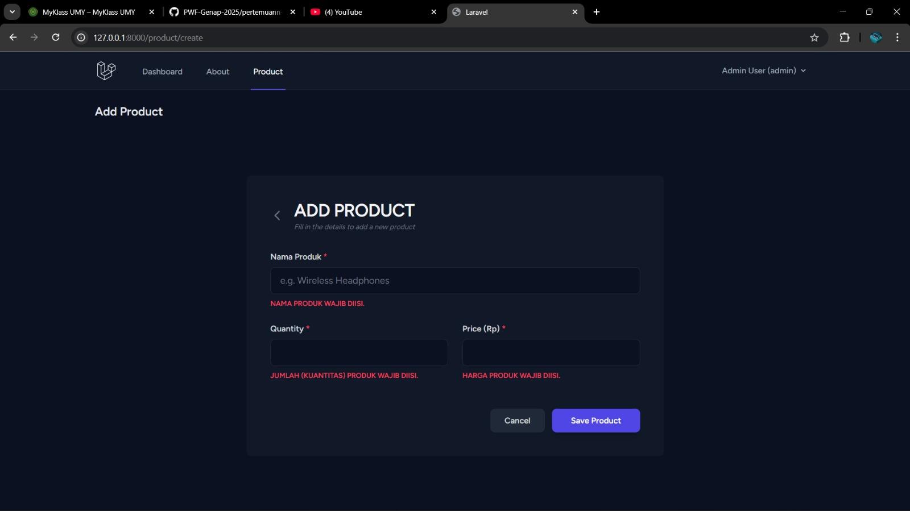
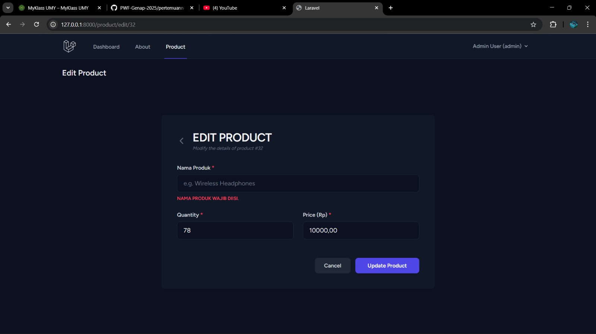
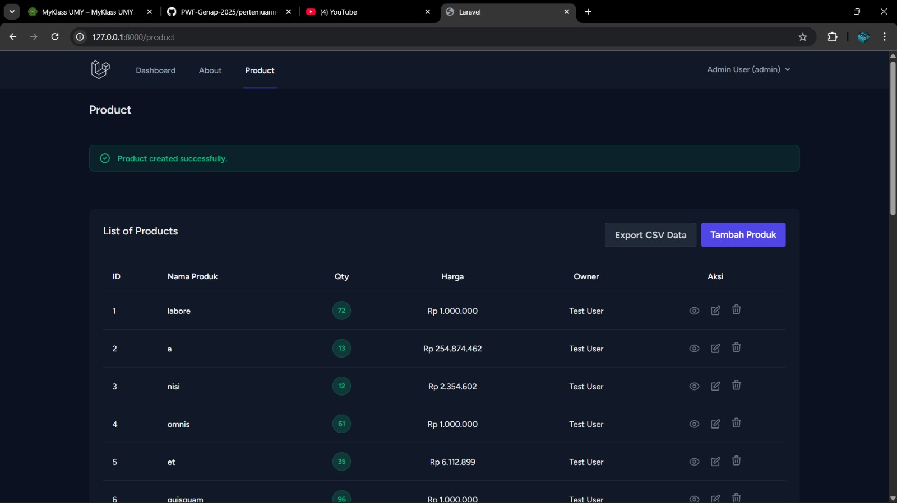

# Modul Pertemuan 6: Validasi Data (Validation)

**Nama:** Hikmatyar Alghifary  
**NIM:** 20230140193  
**Mata Kuliah:** Praktikum Pemrograman Web Framework

---

## 🏗️ Konsep Dasar Validasi

Validasi adalah proses memverifikasi data yang dikirimkan oleh pengguna sebelum data tersebut diproses lebih lanjut atau disimpan ke dalam database. Laravel menyediakan fitur validasi yang sangat kuat untuk memastikan keamanan dan integritas data.

### 🛡️ Alur Kerja Validasi
1.  **Request Datang**: Data dikirimkan melalui form.
2.  **Pengecekan Aturan (Rules)**: Mengecek apakah data sesuai (misal: `required`, `integer`, `numeric`).
3.  **Lolos (Passed)**: Sistem melanjutkan proses penyimpanan data.
4.  **Gagal (Failed)**: Laravel secara otomatis melakukan redirect kembali ke halaman sebelumnya dengan membawa pesan error dan inputan lama (*old input*).

---

## 🛠️ Implementasi Validasi Produk

Dalam praktikum ini, saya mengimplementasikan dua metode validasi yang berbeda sesuai dengan penugasan:

### 1. Validasi di dalam Controller (Metode 1)
Diterapkan pada fungsi `store` untuk penambahan produk baru. Logika validasi dan penanganan error (`try-catch`) ditempatkan langsung di dalam method controller agar mudah dipahami untuk logika yang sederhana.

### 2. Validasi via Form Request (Metode Lanjutan)
Diterapkan pada fungsi `update` untuk pengubahan data produk. Aturan validasi dipisahkan ke dalam file `app/Http/Requests/UpdateProductRequest.php`, yang menerapkan prinsip *Separation of Concerns* agar kode controller tetap bersih dan rapi.

---

## 📸 Dokumentasi Praktikum

Berikut adalah hasil uji coba fitur validasi yang telah diimplementasikan:

### 1. Uji Coba Halaman Tambah Produk
Validasi berhasil menangkap masukan yang tidak sesuai dan menampilkan pesan error dalam Bahasa Indonesia.

### 2. Uji Coba Halaman Edit Produk
Implementasi Form Request (`UpdateProductRequest`) memberikan respon yang sama baiknya saat pengeditan data gagal.

### 3. Notifikasi Berhasil (Success State)
Tampilan ketika seluruh aturan validasi terpenuhi dan data berhasil disimpan ke database.

---

## 📝 Kesimpulan
Dengan mengombinasikan validasi di sisi server (Laravel) dan menonaktifkan validasi bawaan browser (*novalidate*), kita dapat memberikan *feedback* yang lebih jelas dan seragam kepada pengguna melalui pesan kesalahan kustom. Penggunaan **Form Request** sangat direkomendasikan untuk proyek yang lebih besar guna menjaga kerapian kode.
