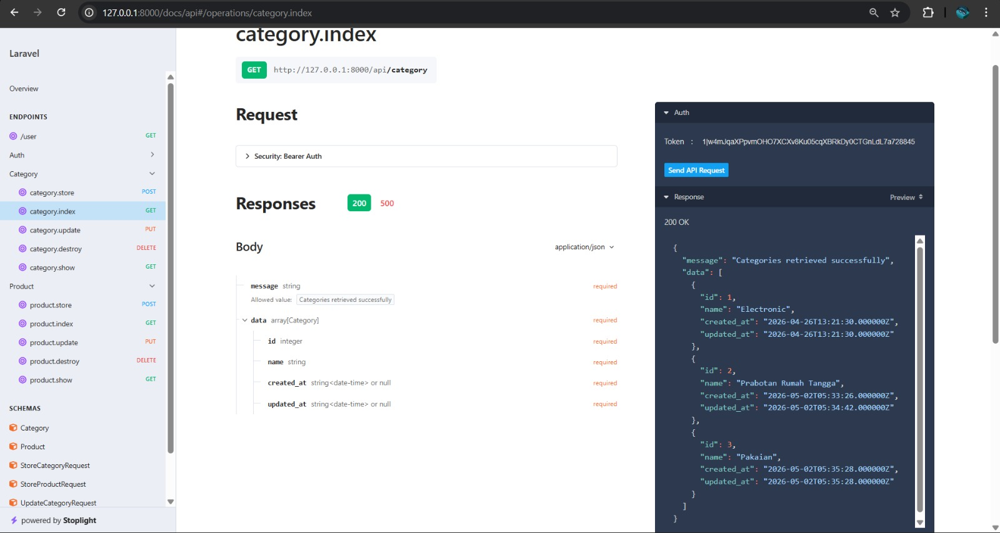
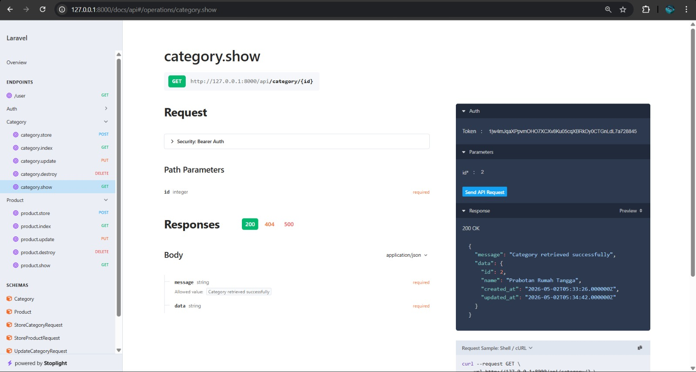
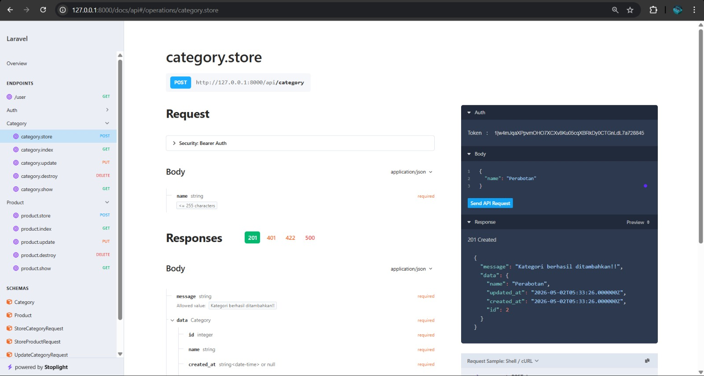
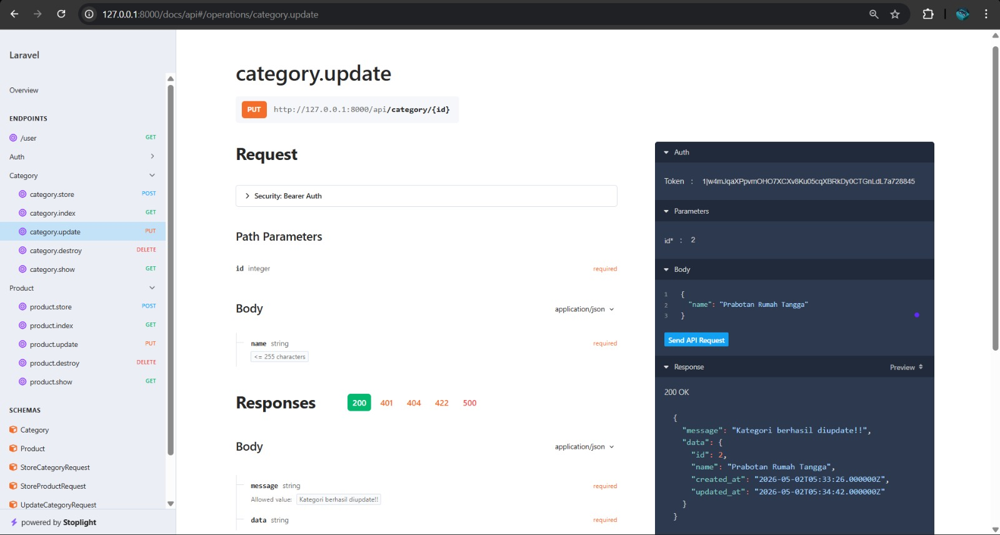
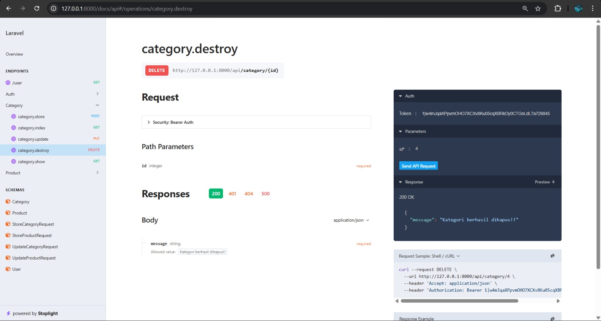
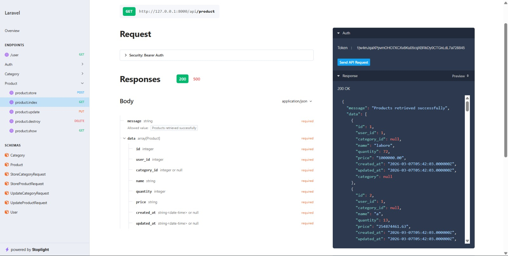
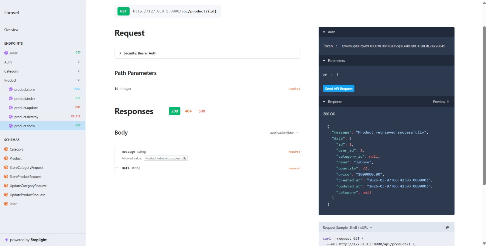
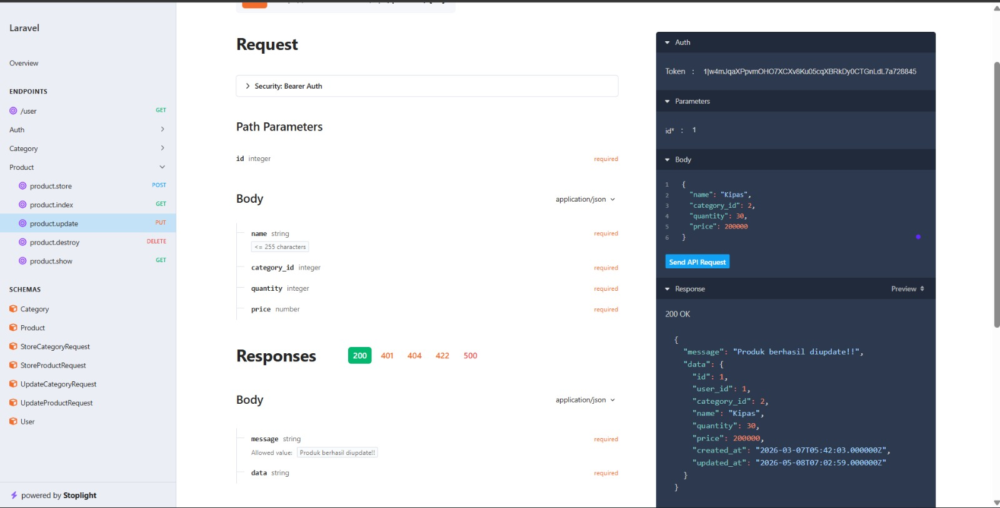
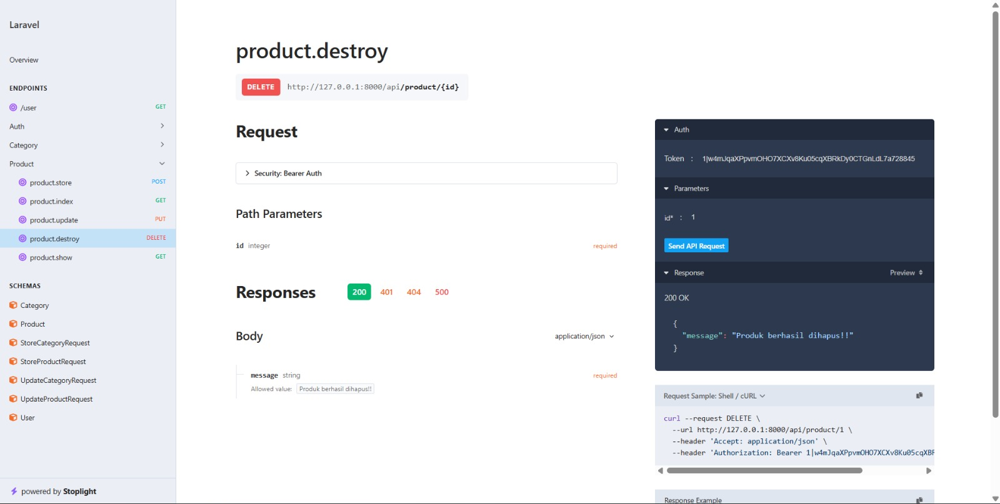

# Modul Pertemuan 9: API CRUD

**Nama:** Hikmatyar Alghifary  
**NIM:** 20230140193  
**Mata Kuliah:** Praktikum Pemrograman Web Framework

Dokumentasi berikut menunjukkan hasil pengujian API untuk Kategori dan Produk menggunakan Postman/Scramble.

## 1. API Category (CRUD)

### Get All Categories
Menampilkan semua data kategori yang tersedia.

### Get Category By ID
Menampilkan detail kategori berdasarkan ID tertentu.

### Add Category (POST)
Menambahkan data kategori baru ke dalam database.

### Update Category (PUT)
Memperbarui data kategori yang sudah ada.

### Delete Category (DELETE)
Menghapus data kategori dari database.

---

## 2. API Product (Lanjutan CRUD)

### Get All Products
Menampilkan semua data produk beserta relasi kategorinya.

### Get Product By ID
Menampilkan detail produk berdasarkan ID tertentu.

### Update Product (PUT)
Memperbarui data produk yang sudah ada.

### Delete Product (DELETE)
Menghapus data produk dari database.

